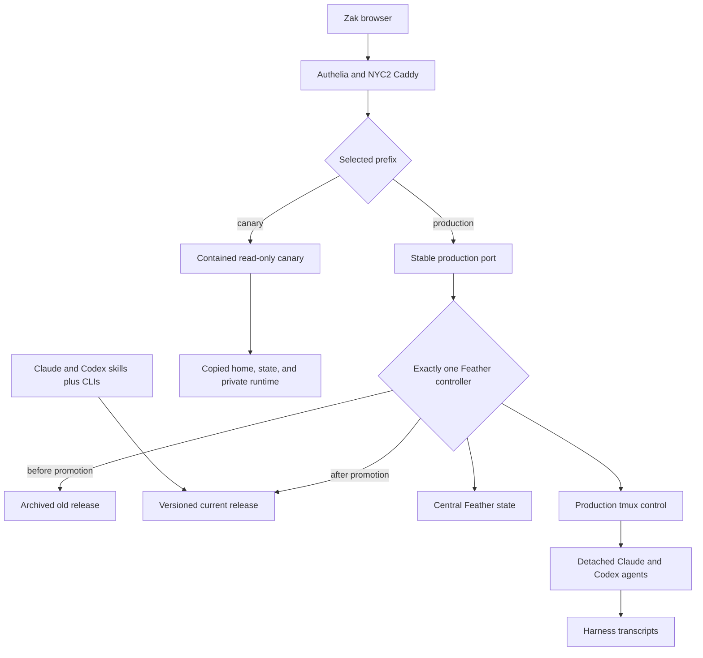
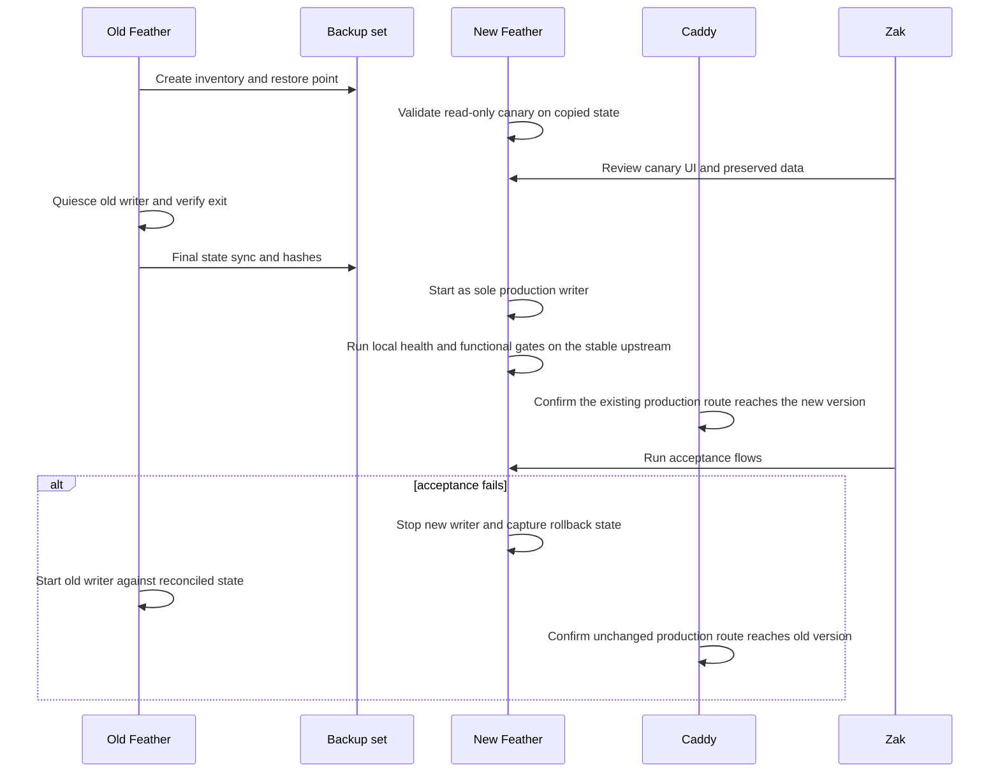
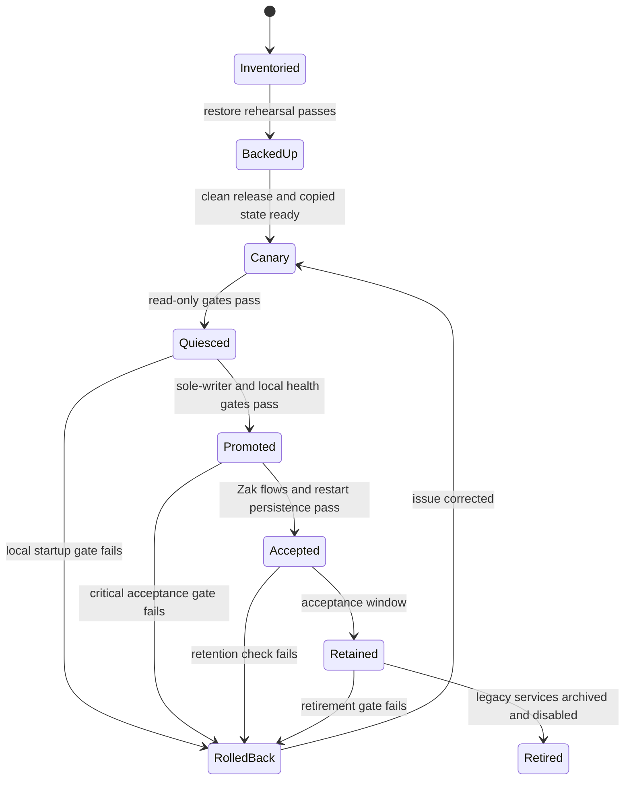

# feat: Safely refeather Zak onto Rooms v2

## Summary

Replace Zak's outdated, personalized Feather deployment with current Feather through a read-only canary, a sole-writer cutover, and an immediate rollback path. Preserve user data and useful customization while replacing the Marriage picker with `#marriage` and installing the full Rooms, Sidecar, Looper, and Feather toolset.

---

## Problem Frame

Zak uses the JavaScript app at `zak.feather-cloud.dev/feather2/`, not the legacy Rust root UI. The active `feather2` checkout is 31 commits behind current `main`, contains uncommitted Marriage-specific behavior, and stores part of its mutable state inside the checkout. A normal `/feather refeather` would rebase this dirty tree in place and restart a hard-coded service, with no complete backup, canary, state reconciliation, or rollback.

The deployment also predates Rooms v2, Sidecar, Looper, Codex skill installation, and the current Rooms performance work. The migration must preserve a 14 GB bind-mounted home, transcript history, metadata, secrets, uploads, VNC, authentication, and live agent continuity without allowing two Feather processes to mutate the same state concurrently.

---

## Requirements

### Data and continuity

- R1. Preserve Claude, Codex, and OMP transcripts; session titles and Codex UUID mappings; links, labels, stars, uploads, boxes, sharing policy, and Feather coordination state.
- R2. Archive both legacy checkouts with their commits, refs, staged and unstaged binary diffs, untracked files, modes, and symlinks before changing runtime state.
- R3. Enforce owner-only permissions for sharing, box, environment, backup, and temporary secret-bearing state, and exclude secret values from logs, receipts, and committed artifacts.
- R4. Preserve intentional detached agent tmux sessions during the application-process cutover; defer the switch rather than killing active work when continuity cannot be proven.
- R5. Produce a verified restore point before canary work and a final restore point immediately before the production writer changes.

### Current Feather behavior

- R6. Serve current `origin/main` under the existing authenticated `/feather2/` prefix with HTTP, SSE, terminal WebSocket, assets, uploads, voice, export, and file previews working under that prefix.
- R7. Centralize mutable instance state outside a release checkout while retaining backward-compatible defaults for existing installations.
- R8. Provide a server-enforced read-only canary mode that blocks every state-changing route, upgrade, background controller, reaper, tmux control action, and implicit mutation.
- R9. Derive Room membership from configured home and Rooms paths rather than one hard-coded user-home encoding.
- R10. Show explicitly assigned Room sessions even when they fall outside the normal recent-session discovery limit.

### Marriage and agent tools

- R11. Replace the bespoke Marriage picker with `#marriage`, preserving its session titles and attaching every known Marriage session without moving the underlying Marriage project files.
- R12. Let a user attach and detach an existing session from any Room in the normal Rooms interface.
- R13. Install `/feather`, `/sidecar`, and `/looper` for both Claude and Codex, plus stable `room` and `sidecar` command wrappers on the spawned-session `PATH`.
- R14. Make Rooms and Sidecar commands discover the configured Feather instance instead of assuming ports 3300 or 4870.
- R15. Verify `room note`, `lookup`, `council`, `second-opinion`, `spawn`, and `handoff`, plus a Sidecar round trip and Looper setup.

### Rollout and reuse

- R16. Replace prose-only `refeather` instructions with a guarded, reusable workflow that refuses unsafe dirty-state upgrades, stages a versioned release, records rollback inputs, and separates build from service promotion.
- R17. Keep exactly one writable Feather server against Zak's production home at every point in cutover and rollback.
- R18. Preserve external authentication, VNC, and utility routes. Use validated graceful Caddy reloads only to add or remove the temporary canary route and, later, to retire the root Rust route; production promotion reuses the existing upstream port.
- R19. Keep the old JavaScript service and Rust root available until Zak accepts the replacement; archive rather than delete old code and data.
- R20. Do not restore Buzz, Centaur, Auto, or the chief-of-staff product model as part of the migration.

---

## Scope Boundaries

### Included

- General Feather changes required for portable Rooms, externalized state, read-only canaries, prefix correctness, safer refeathering, and complete tool installation.
- Zak-specific inventory, backup, canary, Marriage conversion, production switch, rollback drill, and acceptance verification.
- Delayed retirement of the legacy JavaScript and Rust entrypoints after an acceptance window.

### Deferred to Follow-Up Work

- Migrating other `feather-cloud.dev` users after Zak proves the workflow.
- Rebuilding the shared `feather-work` base image around current Feather.
- Converting every legacy project label into a Room; only `#marriage` is required for this migration.
- General multi-instance transactional state locking beyond the sole-writer deployment rule.

### Outside This Work

- Porting the Marriage picker UI into current Feather.
- Deleting Zak's old checkouts, archived patches, Auto data, Buzz data, or other user files.
- Changing Authelia identity policy, VNC implementation, or unrelated NYC2 services.

---

## Key Technical Decisions

- KTD1. **Central state directory with compatibility default:** `FEATHER_STATE_DIR` owns mutable instance files and uploads, while an unset value preserves today's checkout-local behavior. During Zak's maintenance window, backed-up legacy state paths become compatibility symlinks to the central state so rollback reads post-cutover metadata without reverse copying.
- KTD2. **Enforced and contained read-only canary:** Canary safety is a backend contract, not disabled UI. Canary mode disables mutation routes, upgrades, idle reaping, background cleanup, and tmux control; its copied state, runtime directories, and loopback port are isolated, with production mounts absent or read-only as defense in depth.
- KTD3. **Sole-writer production handoff:** Code versions may coexist, but only one Feather stack may write Feather metadata or control sessions. Detached agents may continue their intended append-only transcript writes; the old server stops before the new server starts, and rollback reverses that order.
- KTD4. **Same-container application swap first:** Replace the Node service inside Zak's existing container so its tmux namespace and utility services remain intact. Replacing the whole container or shared base image stays deferred until the application migration is accepted.
- KTD5. **Rooms supersede the Marriage picker:** Historical Marriage sessions receive explicit Room assignments, while new `#marriage` chats use the Room workspace and its notes to point agents at the existing Marriage project.
- KTD6. **Assignment lookup is independent of recency:** The Rooms response combines normal recent discovery with direct resolution of assigned session IDs, so an explicit assignment cannot disappear behind a global candidate limit.
- KTD7. **Prefix behavior is a tested contract:** All browser-to-server paths derive from the mounted application prefix. The actual canary and production prefixes are exercised rather than inferred from root-only tests.
- KTD8. **Versioned release and stable current target:** Supervisor, server, static assets, skills, and CLI wrappers resolve through one atomically replaced release pointer. The pointer changes only while the old writer is stopped, and rollback restores the prior pointer before restart.
- KTD9. **Stable production upstream:** The canary route is validated before a graceful Caddy reload, but production reuses the existing port after the old Node process stops when feasible. This turns promotion and rollback into mutually exclusive process/release flips without changing the accepted public route.
- KTD10. **Retirement follows observed acceptance:** The Rust root and old JavaScript process remain rollback assets until Zak has used the new deployment successfully and restart persistence has been verified.
- KTD11. **Rollback requires schema compatibility:** Compatibility symlinks share bytes, not semantics. Promotion requires a state-version receipt and a downgrade rehearsal with the archived old release; incompatible formats require a tested adapter or block old-code rollback.
- KTD12. **Live transcripts use prefix reconciliation:** Detached agents may append during backup. Receipts track the last complete-record prefix and reconcile only valid suffixes; shrinkage, replacement, non-prefix edits, or malformed records stop the migration.

---

## State Ownership Matrix

| Class | Owner | Representative assets | Migration treatment |
|---|---|---|---|
| Release | Versioned Feather release | Server code, static assets, `version.json`, skills, CLIs | Immutable; promoted by one atomic pointer |
| Instance state | `FEATHER_STATE_DIR` | Session metadata, links, labels, stars, boxes, sharing, uploads | Atomic writes, owner-only secrets, schema/version receipt |
| Coordination state | Feather under configured home | Room assignments, Sidecar registry/threads, Room run journals, sharing access log | Classified and backed up; canary receives an isolated copy |
| Harness state | Claude, Codex, and OMP | Transcripts, harness configuration, native session IDs | Harness-owned; preserve aliases and reconcile live append-only records |
| Room workspaces | Configured Rooms root | Doctrine, Room instructions, notes | Preserve as user workspaces; migrate Marriage through an idempotent receipt |
| Runtime control | Container and supervisor | tmux socket, PTYs, listeners, process journal | Never copied as data; canary isolated, production controller singular |

---

## High-Level Technical Design

### Runtime and state boundaries

The controller selects exactly one production Feather release at a time. Detached agents remain separate append-only transcript writers and are not stopped merely to make the deployment snapshot static.

### Cutover sequence

### Release lifecycle

---

## Implementation Units

### U1. Externalize mutable instance state

- **Goal:** Make release checkouts replaceable without losing or duplicating Feather metadata.
- **Requirements:** R1, R3, R7, R16, R17
- **Dependencies:** None
- **Files:** `server.js`, `lib/sidecar.js`, `lib/state-paths.js`, `.gitignore`, `README.md`, `test/unit/statePaths.test.js`, `test/unit/sidecar.test.js`, `test/unit/api.test.js`
- **Approach:** Classify every release, instance, coordination, harness, workspace, and runtime asset before moving it. Resolve instance metadata and uploads through one configured state root, preserve checkout-local defaults, enforce secret permissions, validate copied JSON, and document compatibility symlinks plus state-schema rollback rules. Newly discovered writable paths fail migration inventory until classified.
- **Execution note:** Add characterization coverage for every current checkout-local path before changing resolution.
- **Patterns to follow:** Existing home-derived `.feather` paths in `server.js`; explicit `0600` writes for sharing state.
- **Test scenarios:**
  - With no configured state root, each mutable file resolves exactly as it does today.
  - With a configured state root, reads and writes use only that root and a clean release checkout remains unchanged.
  - Existing links, metadata, uploads, and sharing grants remain readable after a copied-state migration.
  - A sharing write retains restrictive permissions and never logs token contents.
  - A missing or partially initialized state root is created without replacing an existing file or symlink.
  - A legacy checkout using compatibility symlinks reads metadata and uploads written by the current release without changing secret permissions.
  - Sidecar and Room coordination state remains home-scoped and does not leak into a release checkout or canary runtime.
- **Verification:** A server started from two different clean releases sees identical instance state through the same configured root, one writer at a time.

### U9. Make JSON state writes crash-safe and rollback-aware

- **Goal:** Prevent a stopped process or malformed state file from silently becoming empty state and then permanent data loss.
- **Requirements:** R1, R3, R5, R7, R17
- **Dependencies:** U1
- **Files:** `server.js`, `lib/sidecar.js`, `lib/json-state.js`, `test/unit/jsonState.test.js`, `test/unit/sidecar.test.js`, `test/unit/api.test.js`
- **Approach:** Route mutable JSON documents through one validated state primitive with same-directory atomic replacement, preserved permissions, and last-known-good recovery. Missing files may use documented defaults; malformed existing files fail closed. Record a per-document schema/version compatibility matrix and exercise the archived old release against representative post-upgrade mutations before allowing rollback.
- **Execution note:** Add fault-injection tests before migrating existing writers.
- **Patterns to follow:** Restrictive sharing writes and the existing file-backed state model; replace direct whole-document truncation where it owns durable state.
- **Test scenarios:**
  - A normal write validates and atomically replaces state while retaining required permissions and a last-good recovery copy.
  - Malformed existing JSON blocks startup or mutation instead of returning an empty object that can overwrite valid state.
  - Failure before replacement leaves the prior document readable; failure after replacement leaves either the prior or complete new document, never a truncation.
  - Symlinked legacy state resolves inside the recorded state root and preserves modes.
  - Quick-link, starred, metadata, Room-assignment, sharing, and Sidecar writes retain fields required by the compatibility matrix.
  - The archived old release reads and mutates a copied post-upgrade fixture without dropping unknown state, or the downgrade adapter restores the old-compatible shape.
- **Verification:** Fault injection and downgrade rehearsal demonstrate recoverable JSON documents and a truthful old-release rollback gate.

### U2. Add a server-enforced read-only canary mode

- **Goal:** Permit production-shaped inspection without any path that can alter user state or control a live agent.
- **Requirements:** R3, R8, R17
- **Dependencies:** U1, U9
- **Files:** `server.js`, `test/unit/api.test.js`, `test/e2e/feather.spec.js`
- **Approach:** Inventory all HTTP, upgrade, timer, cleanup, reaper, and tmux-control paths, including GET handlers with side effects, then enforce an allowlisted read-only surface centrally. Return a machine-readable capability signal so the SPA can hide controls without becoming the security boundary; use a private runtime/tmux socket and read-only source mounts where practical.
- **Execution note:** Start with a route and WebSocket characterization matrix; method-only blocking is insufficient.
- **Patterns to follow:** Existing API 404 boundary tests and WebSocket upgrade routing in `server.js`.
- **Test scenarios:**
  - Health, Rooms, sessions, messages, files, and static assets remain readable in canary mode.
  - Session create/resume/send/interrupt/delete/rename, uploads, Room assignments, sharing changes, and Sidecar mutations are rejected without changing state hashes.
  - Terminal and shell WebSocket upgrades are rejected before a PTY or child process starts.
  - A read path that normally performs cleanup does not mutate its registry in canary mode.
  - Idle-reaper and background-controller intervals cannot kill, inject into, attach to, or rename a production tmux session.
  - An absolute symlink or shared temporary path that escapes the copied canary roots fails containment preflight.
  - Normal mode retains the existing mutation behavior.
- **Verification:** A complete canary browsing session leaves source-home, state, tmux, and transcript inventories unchanged.

### U3. Make Rooms portable and complete the Marriage replacement

- **Goal:** Make `#marriage` a complete replacement for the custom picker on Zak's layout.
- **Requirements:** R9, R10, R11, R12
- **Dependencies:** U1, U9
- **Files:** `server.js`, `frontend/src/RoomsHome.tsx`, `frontend/src/api.ts`, `bin/room`, `test/unit/rooms.test.js`, `test/unit/api.test.js`, `test/e2e/feather.spec.js`
- **Approach:** Derive encoded Room paths from configured home and Rooms roots, merge direct lookup of explicitly assigned sessions into Room discovery, and add attach/detach actions to the Room interface. Keep explicit assignment precedence and the existing activity ordering.
- **Execution note:** Add failing tests for a non-default home and an assigned session outside the discovery limit before changing discovery.
- **Patterns to follow:** Existing Room create/assign endpoints, stale-while-refresh snapshot, and `RoomsHome` room/session cards.
- **Test scenarios:**
  - A session launched from a Room under a non-default home groups into that Room without explicit assignment.
  - An explicitly assigned session older than the recent candidate limit still appears with its title and messages.
  - Explicit assignment overrides cwd-derived membership; detach restores cwd-derived behavior.
  - Attach and detach from the UI update the correct Room without duplicating a session.
  - `#marriage` contains all seeded historical IDs, while a new chat uses the Room workspace and leaves the Marriage project directory untouched.
  - Room ordering remains based on the newest real message with notes fallback.
- **Verification:** Zak can open, attach, detach, resume, and create Marriage sessions using Rooms with no picker-only capability loss.

### U4. Close the mounted-prefix gaps

- **Goal:** Make `/feather2/` and a temporary canary prefix equivalent to root deployment for every capability the server advertises in that mode.
- **Requirements:** R6, R18
- **Dependencies:** U2
- **Files:** `frontend/src/App.tsx`, `frontend/src/api.ts`, `frontend/src/components/MessageView.tsx`, `frontend/src/components/Terminal.tsx`, `frontend/vite.config.ts`, `test/e2e/feather.spec.js`
- **Approach:** Route every REST, SSE, WebSocket, upload, voice, export, and file-preview URL through the existing dynamic prefix contract. Add browser coverage against a prefixed reverse proxy rather than mocking path construction.
- **Patterns to follow:** `BASE` in `frontend/src/api.ts`, terminal prefix handling, and the Caddy subpath example in `README.md`.
- **Test scenarios:**
  - The prefixed SPA loads all built assets and survives refresh on a session URL.
  - Health, session list, messages, send, and SSE use the prefix.
  - Terminal and shell WebSockets connect through the prefixed upgrade route in normal production mode.
  - In read-only canary mode, terminal and shell WebSocket attempts reach the prefixed upgrade route and are rejected before PTY creation.
  - Voice transcription, tool-image preview, uploads, downloads, and exports never request root-level API paths.
  - A version change reload preserves the mounted prefix.
  - Desktop and mobile views pass under both canary and final prefixes.
- **Verification:** Browser network traces contain no unintended root-level Feather API or WebSocket request.

### U5. Turn refeather into a guarded release workflow

- **Goal:** Make future upgrades repeatable without rebasing or overwriting a personalized production checkout.
- **Requirements:** R2, R5, R16, R17, R19
- **Dependencies:** U1, U9, U2, U4
- **Files:** `bin/refeather`, `skills/feather/SKILL.md`, `package.json`, `infra/feather.supervisor.conf`, `docs/runbooks/refeather.md`, `README.md`, `test/refeather-e2e.sh`
- **Approach:** Separate build from promotion, stage an immutable versioned release, refuse unsafe source state unless it has an explicit archive receipt, and preflight projected disk demand and dependencies. Serialize deployment with a host-scoped lock and durable phase journal; atomically change the current pointer; verify the expected release hash and health version; and record the service, state snapshots, prior release, and recovery action for every phase. Runtime-specific promotion remains explicit rather than guessing from a directory name.
- **Execution note:** Exercise the workflow against temporary Git repositories and fake service/Caddy adapters before using it on NYC2.
- **Patterns to follow:** Current build/version stamping, health endpoint, and supervisor template; replace the existing in-place rebase prose.
- **Test scenarios:**
  - A clean checkout stages and verifies a release without changing the current target.
  - Dirty, untracked, unpushed, conflicted, low-disk, missing-dependency, and port-collision preflights stop before promotion.
  - An archived dirty checkout proceeds only when its receipt covers refs, binary diff, untracked files, and mutable state.
  - Canary failure leaves the active service and upstream unchanged.
  - Promotion failure restores the prior release target and emits a usable rollback receipt.
  - A second deployment refuses while promotion or rollback owns the host lock.
  - Interruption before or after quiesce, pointer replacement, service start, or receipt persistence resumes to one deterministic safe phase.
  - Build succeeds without restarting the hard-coded `feather` supervisor program.
- **Verification:** A disposable old deployment can be staged, promoted, and rolled back with matching pre/post state manifests and no merge commit or destructive Git operation.

### U6. Install the complete agent capability bundle

- **Goal:** Keep server, skills, and CLIs on the same promoted release for both supported harnesses.
- **Requirements:** R13, R14, R15, R16
- **Dependencies:** U5
- **Files:** `bin/refeather`, `bin/room`, `bin/sidecar`, `skills/feather/SKILL.md`, `skills/sidecar/SKILL.md`, `skills/looper/SKILL.md`, `README.md`, `test/skill-install-e2e.sh`
- **Approach:** Install or update all three skills in verified Claude and Codex skill locations, preserve conflicting pre-existing links as backup evidence, and point CLI wrappers at the versioned current release. Normalize instance discovery around an explicit URL with safe probing fallback.
- **Patterns to follow:** Existing symlink installation and Sidecar port probing.
- **Test scenarios:**
  - Fresh install exposes Feather, Sidecar, and Looper to Claude and Codex and exposes `room` and `sidecar` on spawned-session `PATH`.
  - Re-running installation is idempotent after a release promotion.
  - A conflicting file or foreign symlink aborts with backup guidance rather than overwriting it.
  - Instance discovery selects Zak's configured server and does not silently connect to an unrelated local port.
  - `room` commands, a Sidecar exchange, and Looper setup work from both harnesses.
- **Verification:** New Feather-spawned Claude and Codex sessions enumerate the same promoted skills and successfully invoke the CLIs.

### U7. Stage and validate Zak's isolated canary

- **Goal:** Prove current Feather against a faithful copy of Zak's data and routing without touching production state.
- **Requirements:** R1-R11, R13-R14, R18-R20
- **Dependencies:** U1-U6, U9
- **Files:** `docs/runbooks/refeather.md`
- **Approach:** Produce two independently restorable artifacts: complete dirty-checkout archives and a classified mutable-state/home snapshot with modes, ownership, links, hashes, exclusions, and encrypted-secret handling. Rehearse both into an independent destination with the archived old release. Create canary-only home, state, runtime, temporary, and tmux roots; verify every writable realpath stays inside them; bind only to loopback; and expose the unique port through an authenticated temporary prefix. Build an authoritative Marriage manifest from the archived picker's backing data, native harness IDs, canonical Feather IDs, transcript paths, titles, cwd, and assignments, then require exact set equality in the canary Room.
- **Patterns to follow:** The runbook gates created in U5 and the existing prefixed Caddy route shape.
- **Test scenarios:**
  - Backup and restore rehearsal reconstructs both dirty checkouts and the complete classified state in an independent destination with matching modes, symlinks, refs, and hashes.
  - Unauthenticated canary access is denied; authenticated access reaches only the canary port.
  - Direct access to the loopback canary port is unavailable externally, and route ordering cannot fall through around Authelia.
  - Canary preflight rejects an absolute symlink, socket, temporary path, mount, or writable realpath that reaches production state or tmux control.
  - Canary health/version, Rooms, session history, files, UI, prefix flows, VNC link, and mobile view pass.
  - All production state and tmux inventories are byte-for-byte or semantically unchanged after canary testing.
  - The Marriage manifest has exact set equality with `#marriage`, including native aliases and sessions beyond the recent discovery limit, with no unresolved or duplicate member.
  - Any auth bypass, unexpected write, missing ID, bad hash, or config-validation failure aborts before production traffic changes.
- **Verification:** A signed-off canary receipt proves exact membership and state parity, OS-level containment, zero production writes or tmux control, and a rehearsed full restore path.

### U8. Perform the sole-writer cutover, rollback drill, and delayed retirement

- **Goal:** Promote current Feather with bounded interruption and prove that both restart and rollback preserve user work.
- **Requirements:** R1-R6, R11-R20
- **Dependencies:** U7
- **Files:** `docs/runbooks/refeather.md`
- **Approach:** Enter a maintenance barrier that rejects new mutations and upgrades, drains in-flight writes, suppresses legacy autorestart, and verifies the old Node process and listener exited while intentional tmux sessions remain. Capture the final restore point, migrate central state and compatibility links, and apply an idempotent production `#marriage` receipt before atomically selecting the tested release. Use a provider snapshot when available; otherwise reconcile complete transcript prefixes separately from quiesced Feather metadata. Start current Feather as the only controller on the existing port, verify listener ownership and local functional gates, and confirm the unchanged public route reports the promoted version. Rollback first blocks writes, stops current, captures post-cutover state, validates compatibility, restores the prior pointer, and only then starts old. Route the root path and disable Rust after Zak's acceptance window and restart checks.
- **Patterns to follow:** Supervisor's named-program lifecycle, canary-only Caddy validated reloads, and the release receipt from U5.
- **Test scenarios:**
  - The handoff never shows two writable Feather processes, preserves pre-existing tmux sessions, and tolerates documented complete-record appends from detached agents.
  - Legacy autorestart cannot reclaim the production port after quiesce, and exactly one expected PID owns the listener after each transition.
  - Production `#marriage` matches the approved canary manifest and its receipt can validate or reverse every created file and assignment.
  - Local health, Room/session discovery, old-session resume, new Claude and Codex chat, send/SSE, interrupt, terminal WS, upload/file preview, Sidecar, and Room commands pass before public promotion.
  - The public authenticated `/feather2/` path reports the promoted version; unauthenticated access remains denied; VNC and utilities are unchanged.
  - Restarting the promoted service preserves metadata, Room assignments, skills, links, uploads, and active-session detection.
  - Restarting Supervisor/the container preserves the expected environment, release pointer, sole listener, auth, state, VNC, utilities, and capability links.
  - A rollback after one new test session preserves that transcript, title, assignment, and upload while restoring the old process on the stable upstream with only one writer.
  - Failure injected after quiesce, pointer replacement, and service start resumes or rolls back without dual writers or an ambiguous phase.
  - Legacy JavaScript and Rust services remain available but stopped during retention, then archive cleanly after Zak accepts the replacement.
- **Verification:** Zak completes the acceptance flows, the restart check passes, the rollback drill is documented, and legacy retirement happens only after the retention gate.

---

## System-Wide Impact

- **State lifecycle:** Instance metadata becomes release-independent, making future upgrades and rollbacks safer for every Feather deployment.
- **Security boundary:** Read-only mode and Caddy authentication become explicit canary gates; sharing secrets retain restricted storage and redacted receipts.
- **Session lifecycle:** The service process can change without replacing the container or tmux namespace, preserving detached work while preventing dual control.
- **Rooms semantics:** Explicit membership becomes durable regardless of home path or recent-session limits, and attach/detach becomes a normal user capability.
- **Operational posture:** `refeather` changes from an in-place source update into a versioned release promotion with preflight and rollback evidence.

---

## Acceptance Examples

- AE1. **Dirty legacy checkout:** Given Zak's checkout has local modifications, when refeather preflight runs, then it refuses promotion until a restorable archive receipt exists and does not alter the checkout.
- AE2. **Contained read-only canary:** Given the canary has copied state and private runtime roots, when a user browses every view and attempts mutations, then reads work, mutations fail, no symlink or socket reaches production, and production hashes and tmux state do not change.
- AE3. **Old Marriage session:** Given a Marriage session falls outside the newest discovery candidates, when its explicit assignment is loaded, then it appears in `#marriage` with its preserved title and can be opened.
- AE4. **Production handoff:** Given old Feather owns production state, when cutover begins, then old exits before current Feather writes and intentional detached tmux sessions remain alive.
- AE5. **Prefixed behavior:** Given current Feather is mounted below `/feather2/`, when voice, file preview, terminal, SSE, and export are used, then every request remains under that prefix.
- AE6. **Post-cutover rollback:** Given schema downgrade rehearsal passed and a new session and upload were created after promotion, when rollback is triggered, then new Feather stops first and the restored old service sees the new transcript, title, assignment, and upload without dropping unknown state.
- AE7. **Capability parity:** Given a new Claude or Codex session starts after promotion, when it inspects available Feather tools, then Feather, Sidecar, Looper, `room`, and `sidecar` resolve from the promoted release.
- AE8. **Legacy retirement:** Given Zak has accepted current Feather and restart persistence, when retention ends, then the old JavaScript and Rust entrypoints can be disabled without affecting `/feather2/`, VNC, or utility routes.
- AE9. **Interrupted promotion:** Given deployment stops after quiesce, pointer replacement, or service start, when the operator resumes from the phase journal, then the workflow reaches one healthy writer or a verified old-writer rollback without ambiguity.
- AE10. **Restart persistence:** Given promotion is accepted, when the production process and then Supervisor/container restart, then the expected release, environment, state, skills, route, VNC, and sole listener return.
- AE11. **Production Marriage migration:** Given the canary Marriage manifest is approved, when the production migration receipt applies after quiesce, then production `#marriage` has exact set equality and can validate or reverse its changes.

---

## Risks and Dependencies

- **Backup capacity:** Zak's home is approximately 14 GB and NYC2 has approximately 75 GB free. Preflight projects allocated size for source archives, two restore points, canary copy, build workspace, and retention growth; cleanup never removes the last verified restore point.
- **Concurrent mutation:** Shared bind mounts provide no application-level locking. Read-only canary enforcement and the sole-writer gate are mandatory.
- **Canary escape:** A copied home can retain absolute links, shared sockets, or temporary paths. Canary containment validates realpaths, uses private runtime roots, disables background controllers, and denies external direct-port access.
- **State rollback:** Restoring the pre-cutover snapshot after new writes would lose metadata. Rollback captures post-cutover state, requires the compatibility matrix or downgrade adapter, and stops for a recovery decision when the old release would discard state.
- **Append-only transcript drift:** Detached agents may write during backup. Prefer a provider snapshot; otherwise record complete-prefix boundaries and stop on shrinkage, replacement, non-prefix change, duplicates, or malformed JSON.
- **Active sessions:** Replacing the whole container would destroy its tmux namespace. This plan swaps application services inside the existing container and defers image replacement.
- **Secret handling:** Sharing and box state may contain tokens. Backups and receipts must preserve permissions while redacting values from output.
- **Prefix drift:** Root-only success is insufficient; the actual canary and production prefixes must pass HTTP, SSE, and WebSocket tests.
- **Skill discovery:** Codex skill symlink behavior must be verified on Zak's installed Codex version rather than assumed from Claude conventions.
- **Acceptance dependency:** Disabling the Rust root depends on Zak's observed acceptance and a restart check, not only automated tests.
- **Operator interruption:** Promotion can fail between quiesce, pointer change, start, health, and receipt persistence. The deployment lock and phase journal make each transition resumable and idempotent.

---

## Documentation and Operational Notes

- `docs/runbooks/refeather.md` becomes the authoritative reusable operator flow; `/feather refeather` should point to the guarded executable and summarize its safety model.
- Store Zak-specific backup locations, hashes, service identifiers, and rollback receipts outside the public repository.
- Record preflight, canary, cutover, restart, rollback, and retirement as separate receipts so a later operator can tell which gate was last completed.
- Treat noncritical visual defects separately from critical data, auth, session-control, SSE, WebSocket, and rollback failures.
- Zak approves the user-facing acceptance flows; the operator approves backup, containment, sole-writer, schema, and rollback gates. Observe at least one normal Zak workday plus process and Supervisor/container restarts before disabling legacy autostart.
- Roll back automatically for auth bypass, dual Feather writers, corrupt state, missing session sets, transcript-prefix failure, or lost session control. Monitor health/version, server errors, auth failures, SSE/WS disconnects, process restarts, state parse/write errors, disk growth, and transcript append integrity throughout retention.
- Retirement first disables legacy routes and autostart while retaining binaries, configuration, state, and restore points for a second rollback window; this plan deletes nothing.

---

## Sources and Research

- Current deployment and feature patterns: `README.md`, `server.js`, `frontend/src/api.ts`, `frontend/src/components/Terminal.tsx`, `infra/feather.supervisor.conf`, `skills/feather/SKILL.md`, `skills/sidecar/SKILL.md`, `skills/looper/SKILL.md`, and `docs/plans/2026-08-20-005-feat-rooms-v2-plan.md`.
- [Caddy command-line validation and reload](https://caddyserver.com/docs/command-line) and [atomic configuration API](https://caddyserver.com/docs/api) support validate-before-reload and retained active configuration on failure.
- [Caddy reverse proxy](https://caddyserver.com/docs/caddyfile/directives/reverse_proxy) documents explicit upstreams, streaming flush behavior, and health checks.
- [Podman bind-mount semantics](https://docs.podman.io/en/stable/markdown/podman-create.1.html) establish that shared writable mounts expose changes immediately and provide no writer lock.
- [Podman health checks](https://docs.podman.io/en/stable/markdown/podman-healthcheck.1.html) inform process-health gates, though product acceptance remains broader than liveness.
- [Supervisor process control](https://supervisord.org/configuration.html) informs named process shutdown and child-process handling during handoff.
